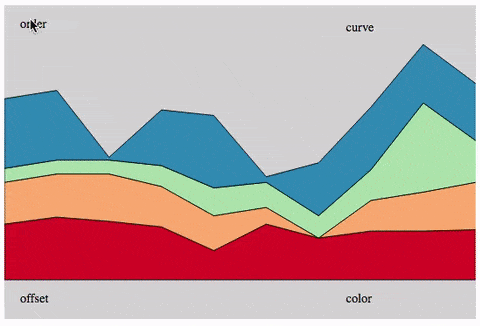
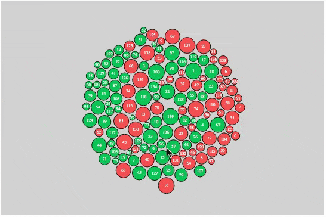
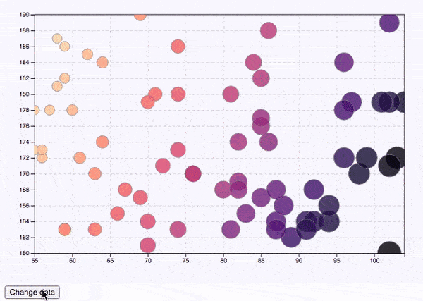

# D3
SVG studies. Chart and graph renderings. 
  * Shapes
  * Scales
  * Interactions
  * Generators
  * SVG Paths
  * Data transformations
  * Transitions

# D3 Stack Charts

# D3 Force Simulations

# D3 Bubble Charts

